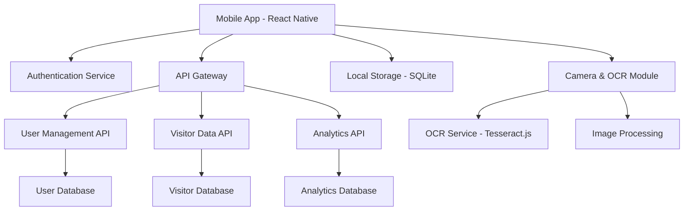

# Design Document

## Overview

The Visitor Management App is a React Native mobile application that enables event staff to efficiently capture visitor information through OCR technology. The app features secure authentication, real-time performance tracking, and dual scanning capabilities for business cards and event badges. The architecture prioritizes offline-first functionality, intuitive user experience, and reliable data synchronization.

## Architecture

### High-Level Architecture



### Technology Stack

**Frontend:**
- React Native 0.72+
- TypeScript for type safety
- React Navigation 6 for routing
- React Hook Form for form management
- AsyncStorage for local data persistence
- SQLite for offline data storage

**OCR & Image Processing:**
- react-native-vision-camera for camera functionality
- @react-native-ml-kit/text-recognition for OCR
- react-native-image-picker as fallback
- react-native-image-resizer for image optimization

**Backend APIs:**
- Node.js with Express.js
- JWT for authentication
- PostgreSQL for production database
- Redis for session management

## Components and Interfaces

### Core Components

#### 1. Authentication Module
```typescript
interface AuthService {
  login(username: string, password: string): Promise<AuthResult>
  logout(): Promise<void>
  refreshToken(): Promise<string>
  isAuthenticated(): boolean
}

interface AuthResult {
  success: boolean
  token?: string
  user?: UserProfile
  error?: string
}
```

#### 2. Camera & OCR Module
```typescript
interface OCRService {
  scanBusinessCard(imageUri: string): Promise<BusinessCardData>
  scanEventBadge(imageUri: string): Promise<EventBadgeData>
  processImage(imageUri: string, scanType: ScanType): Promise<OCRResult>
}

interface BusinessCardData {
  name?: string
  title?: string
  company?: string
  phone?: string
  email?: string
  website?: string
  confidence: number
}

interface EventBadgeData {
  name?: string
  company?: string
  confidence: number
}
```

#### 3. Visitor Management Module
```typescript
interface VisitorService {
  createVisitor(data: VisitorData): Promise<Visitor>
  updateVisitor(id: string, data: Partial<VisitorData>): Promise<Visitor>
  getVisitorsByUser(userId: string): Promise<Visitor[]>
  syncVisitors(): Promise<SyncResult>
}

interface VisitorData {
  name: string
  title?: string
  company: string
  phone?: string
  email?: string
  website?: string
  interests: InterestCategory[]
  notes?: string
  captureMethod: 'business_card' | 'event_badge'
  capturedBy: string
  capturedAt: Date
}
```

#### 4. Analytics Module
```typescript
interface AnalyticsService {
  getDailyStats(userId: string, date: Date): Promise<DailyStats>
  getMonthlyStats(userId: string, month: number, year: number): Promise<MonthlyStats>
  getUserPerformance(userId: string): Promise<PerformanceMetrics>
}

interface DailyStats {
  visitorsToday: number
  lastUpdated: Date
}

interface MonthlyStats {
  visitorsThisMonth: number
  dailyBreakdown: DailyCount[]
}
```

### Screen Components

#### 1. Login Screen
- Username/password input fields
- Login button with loading state
- Error message display
- Remember me functionality

#### 2. Dashboard Screen
- Performance metrics cards
- Quick action buttons
- Recent visitors list
- Sync status indicator

#### 3. Capture Method Selection Screen
- Business card scanning option
- Event badge scanning option
- Visual icons and descriptions
- Back navigation

#### 4. Camera Screen
- Camera preview
- Capture button
- Flash toggle
- Retake functionality
- Processing overlay

#### 5. Visitor Form Screen
- Auto-populated fields from OCR
- Manual edit capabilities
- Interest category selection
- Notes text area
- Save/cancel actions

## Data Models

### User Model
```typescript
interface User {
  id: string
  username: string
  email: string
  firstName: string
  lastName: string
  role: 'staff' | 'admin'
  isActive: boolean
  createdAt: Date
  lastLoginAt?: Date
}
```

### Visitor Model
```typescript
interface Visitor {
  id: string
  name: string
  title?: string
  company: string
  phone?: string
  email?: string
  website?: string
  interests: InterestCategory[]
  notes?: string
  captureMethod: 'business_card' | 'event_badge'
  capturedBy: string
  capturedAt: Date
  syncedAt?: Date
  isLocal: boolean
}

type InterestCategory = 'LOS' | 'LMS' | 'Reconciliation Software' | 'CBS' | 'API Portal'
```

### Local Storage Schema
```sql
-- SQLite schema for offline storage
CREATE TABLE visitors (
  id TEXT PRIMARY KEY,
  name TEXT NOT NULL,
  title TEXT,
  company TEXT NOT NULL,
  phone TEXT,
  email TEXT,
  website TEXT,
  interests TEXT, -- JSON array
  notes TEXT,
  capture_method TEXT NOT NULL,
  captured_by TEXT NOT NULL,
  captured_at DATETIME NOT NULL,
  synced_at DATETIME,
  is_local INTEGER DEFAULT 1
);

CREATE TABLE sync_queue (
  id TEXT PRIMARY KEY,
  visitor_id TEXT,
  action TEXT, -- 'create', 'update', 'delete'
  data TEXT, -- JSON
  created_at DATETIME DEFAULT CURRENT_TIMESTAMP
);
```

## Error Handling

### OCR Error Handling
- **Low confidence scores**: Prompt user to retake photo or manually verify data
- **No text detected**: Show helpful tips for better image capture
- **Processing timeout**: Fallback to manual entry with pre-filled template
- **Camera permissions**: Clear instructions for enabling permissions

### Network Error Handling
- **Offline mode**: Store data locally and sync when connection restored
- **API failures**: Retry mechanism with exponential backoff
- **Authentication errors**: Automatic token refresh or redirect to login
- **Sync conflicts**: Last-write-wins strategy with user notification

### Data Validation
- **Required fields**: Real-time validation with clear error messages
- **Email format**: Pattern validation with suggestions
- **Phone format**: Auto-formatting and validation
- **Duplicate detection**: Warn user of potential duplicates

## Testing Strategy

### Unit Testing
- **OCR Service**: Mock image processing and test data extraction accuracy
- **Visitor Service**: Test CRUD operations and data validation
- **Auth Service**: Test login/logout flows and token management
- **Analytics Service**: Test metric calculations and data aggregation

### Integration Testing
- **Camera Integration**: Test camera permissions and image capture
- **Database Operations**: Test SQLite operations and data persistence
- **API Integration**: Test network requests and error handling
- **Sync Functionality**: Test offline/online data synchronization

### End-to-End Testing
- **Complete User Flows**: Test full visitor capture workflow
- **Authentication Flow**: Test login to dashboard navigation
- **OCR Accuracy**: Test with sample business cards and badges
- **Performance Testing**: Test app responsiveness during OCR processing

### Device Testing
- **Android Versions**: Test on Android 8.0+ devices
- **Screen Sizes**: Test responsive design on various screen sizes
- **Camera Quality**: Test OCR accuracy across different camera qualities
- **Performance**: Test on low-end devices for smooth operation

## Security Considerations

### Authentication & Authorization
- JWT tokens with short expiration times
- Secure token storage using Keychain/Keystore
- Automatic token refresh mechanism
- Role-based access control

### Data Protection
- Encrypt sensitive data in local storage
- Secure API communication with HTTPS
- Input sanitization and validation
- PII data handling compliance

### Image Security
- Temporary image storage with automatic cleanup
- No permanent storage of captured images
- Secure image transmission to OCR service
- User consent for camera usage