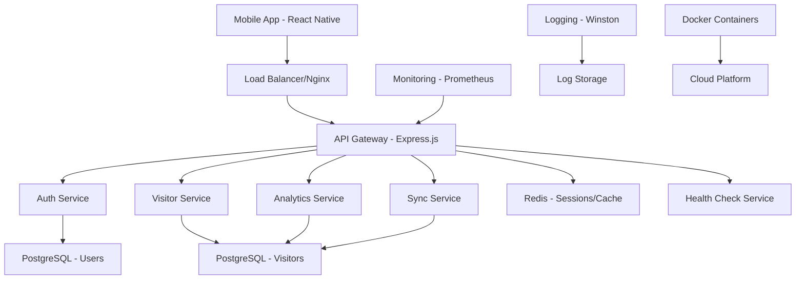

# Design Document

## Overview

The Visitor Management Backend is a Node.js/Express.js server system that provides production-ready infrastructure for the mobile app. It features dual-mode data storage (PostgreSQL for online operations, coordinated with SQLite for offline), user authentication with registration, and enterprise-grade capabilities. The architecture is designed for scalability, security, and seamless integration with the existing React Native app.

## Architecture

### High-Level Architecture



### Technology Stack

**Backend Core:**
- Node.js 18+ with TypeScript
- Express.js 4.x for REST API
- PostgreSQL 15+ for primary database
- Redis 7+ for session management and caching

**Security & Authentication:**
- JWT tokens with refresh token rotation
- bcrypt for password hashing
- helmet.js for security headers
- express-rate-limit for API protection

**Monitoring & Operations:**
- Winston for structured logging
- Prometheus metrics collection
- Health check endpoints
- Docker containerization

**Development & Testing:**
- Jest for unit and integration testing
- Supertest for API testing
- TypeScript for type safety
- ESLint and Prettier for code quality

## Components and Interfaces

### Core Services

#### 1. Authentication Service
```typescript
interface AuthService {
  register(userData: RegisterRequest): Promise<AuthResponse>
  login(credentials: LoginRequest): Promise<AuthResponse>
  refreshToken(refreshToken: string): Promise<TokenResponse>
  logout(userId: string): Promise<void>
  validateToken(token: string): Promise<UserPayload>
}

interface RegisterRequest {
  email: string
  password: string
  firstName: string
  lastName: string
}

interface AuthResponse {
  success: boolean
  user?: UserProfile
  accessToken?: string
  refreshToken?: string
  error?: string
}
```

#### 2. Visitor Service
```typescript
interface VisitorService {
  createVisitor(visitorData: CreateVisitorRequest): Promise<VisitorResponse>
  updateVisitor(id: string, updates: UpdateVisitorRequest): Promise<VisitorResponse>
  getVisitorsByUser(userId: string, filters?: VisitorFilters): Promise<VisitorListResponse>
  deleteVisitor(id: string, userId: string): Promise<DeleteResponse>
  bulkSync(syncData: BulkSyncRequest): Promise<BulkSyncResponse>
}

interface CreateVisitorRequest {
  name: string
  title?: string
  company: string
  phone?: string
  email?: string
  website?: string
  interests: string[]
  notes?: string
  captureMethod: 'business_card' | 'event_badge'
  capturedAt: string
}
```

#### 3. Analytics Service
```typescript
interface AnalyticsService {
  getDailyStats(userId: string, date: string): Promise<DailyStatsResponse>
  getMonthlyStats(userId: string, month: number, year: number): Promise<MonthlyStatsResponse>
  getVisitorReport(userId: string, filters: ReportFilters): Promise<ReportResponse>
  exportData(userId: string, format: 'csv' | 'json', filters?: ReportFilters): Promise<ExportResponse>
}
```

#### 4. Sync Service
```typescript
interface SyncService {
  processBulkSync(userId: string, operations: SyncOperation[]): Promise<BulkSyncResult>
  resolveConflicts(conflicts: ConflictData[]): Promise<ConflictResolution[]>
  getLastSyncTimestamp(userId: string): Promise<string>
}

interface SyncOperation {
  action: 'create' | 'update' | 'delete'
  localId: string
  data: any
  timestamp: string
}
```

## Data Models

### PostgreSQL Schema

#### Users Table
```sql
CREATE TABLE users (
  id UUID PRIMARY KEY DEFAULT gen_random_uuid(),
  email VARCHAR(255) UNIQUE NOT NULL,
  password_hash VARCHAR(255) NOT NULL,
  first_name VARCHAR(100) NOT NULL,
  last_name VARCHAR(100) NOT NULL,
  is_active BOOLEAN DEFAULT true,
  created_at TIMESTAMP WITH TIME ZONE DEFAULT CURRENT_TIMESTAMP,
  updated_at TIMESTAMP WITH TIME ZONE DEFAULT CURRENT_TIMESTAMP,
  last_login_at TIMESTAMP WITH TIME ZONE
);

CREATE INDEX idx_users_email ON users(email);
CREATE INDEX idx_users_active ON users(is_active);
```

#### Visitors Table
```sql
CREATE TABLE visitors (
  id UUID PRIMARY KEY DEFAULT gen_random_uuid(),
  user_id UUID NOT NULL REFERENCES users(id) ON DELETE CASCADE,
  name VARCHAR(255) NOT NULL,
  title VARCHAR(255),
  company VARCHAR(255) NOT NULL,
  phone VARCHAR(50),
  email VARCHAR(255),
  website VARCHAR(500),
  interests JSONB NOT NULL,
  notes TEXT,
  capture_method VARCHAR(20) NOT NULL CHECK (capture_method IN ('business_card', 'event_badge')),
  captured_at TIMESTAMP WITH TIME ZONE NOT NULL,
  created_at TIMESTAMP WITH TIME ZONE DEFAULT CURRENT_TIMESTAMP,
  updated_at TIMESTAMP WITH TIME ZONE DEFAULT CURRENT_TIMESTAMP,
  
  -- Sync tracking
  local_id VARCHAR(255), -- Original ID from mobile app
  sync_version INTEGER DEFAULT 1
);

CREATE INDEX idx_visitors_user_id ON visitors(user_id);
CREATE INDEX idx_visitors_captured_at ON visitors(captured_at);
CREATE INDEX idx_visitors_company ON visitors(company);
CREATE INDEX idx_visitors_local_id ON visitors(local_id);
CREATE INDEX idx_visitors_interests ON visitors USING GIN(interests);
```

#### Refresh Tokens Table
```sql
CREATE TABLE refresh_tokens (
  id UUID PRIMARY KEY DEFAULT gen_random_uuid(),
  user_id UUID NOT NULL REFERENCES users(id) ON DELETE CASCADE,
  token_hash VARCHAR(255) NOT NULL,
  expires_at TIMESTAMP WITH TIME ZONE NOT NULL,
  created_at TIMESTAMP WITH TIME ZONE DEFAULT CURRENT_TIMESTAMP,
  is_revoked BOOLEAN DEFAULT false
);

CREATE INDEX idx_refresh_tokens_user_id ON refresh_tokens(user_id);
CREATE INDEX idx_refresh_tokens_expires_at ON refresh_tokens(expires_at);
```

### API Endpoints

#### Authentication Endpoints
```
POST /api/auth/register
POST /api/auth/login
POST /api/auth/refresh
POST /api/auth/logout
GET  /api/auth/me
```

#### Visitor Management Endpoints
```
POST   /api/visitors              # Create visitor
GET    /api/visitors              # Get user's visitors (with pagination/filters)
GET    /api/visitors/:id          # Get specific visitor
PUT    /api/visitors/:id          # Update visitor
DELETE /api/visitors/:id          # Delete visitor
POST   /api/visitors/bulk-sync    # Bulk sync from mobile app
```

#### Analytics Endpoints
```
GET /api/analytics/daily/:date     # Daily stats
GET /api/analytics/monthly/:year/:month  # Monthly stats
GET /api/analytics/report          # Custom report with filters
GET /api/analytics/export          # Export data (CSV/JSON)
```

#### System Endpoints
```
GET /api/health                    # Health check
GET /api/metrics                   # Prometheus metrics
GET /api/version                   # API version info
```

## Security Implementation

### Authentication & Authorization
- **JWT Access Tokens**: Short-lived (15 minutes) for API access
- **Refresh Tokens**: Long-lived (7 days) stored securely in database
- **Password Security**: bcrypt with salt rounds of 12
- **Token Rotation**: New refresh token issued on each refresh

### API Security
```typescript
// Rate limiting configuration
const rateLimits = {
  auth: { windowMs: 15 * 60 * 1000, max: 5 },      // 5 attempts per 15 min
  api: { windowMs: 15 * 60 * 1000, max: 100 },     // 100 requests per 15 min
  sync: { windowMs: 5 * 60 * 1000, max: 10 }       // 10 syncs per 5 min
}

// Security headers
app.use(helmet({
  contentSecurityPolicy: false, // API only
  crossOriginEmbedderPolicy: false
}))
```

### Data Protection
- Input validation using Joi schemas
- SQL injection prevention with parameterized queries
- XSS protection through data sanitization
- CORS configuration for mobile app origins

## Error Handling

### Error Response Format
```typescript
interface ErrorResponse {
  success: false
  error: {
    code: string
    message: string
    details?: any
    correlationId: string
  }
}

// Standard error codes
enum ErrorCodes {
  VALIDATION_ERROR = 'VALIDATION_ERROR',
  AUTHENTICATION_FAILED = 'AUTHENTICATION_FAILED',
  AUTHORIZATION_FAILED = 'AUTHORIZATION_FAILED',
  RESOURCE_NOT_FOUND = 'RESOURCE_NOT_FOUND',
  DUPLICATE_RESOURCE = 'DUPLICATE_RESOURCE',
  RATE_LIMIT_EXCEEDED = 'RATE_LIMIT_EXCEEDED',
  INTERNAL_SERVER_ERROR = 'INTERNAL_SERVER_ERROR',
  DATABASE_ERROR = 'DATABASE_ERROR',
  SYNC_CONFLICT = 'SYNC_CONFLICT'
}
```

### Sync Conflict Resolution
```typescript
interface ConflictResolution {
  strategy: 'server_wins' | 'client_wins' | 'merge' | 'manual'
  resolvedData?: any
  requiresManualReview?: boolean
}

// Conflict resolution rules
const conflictRules = {
  // Server timestamp wins for data integrity
  default: 'server_wins',
  // Merge strategies for specific fields
  notes: 'merge',
  interests: 'merge'
}
```

## Performance & Scalability

### Database Optimization
- Connection pooling with pg-pool
- Query optimization with proper indexing
- Prepared statements for frequent queries
- Database connection health monitoring

### Caching Strategy
```typescript
// Redis caching layers
const cacheConfig = {
  userSessions: { ttl: 900 },      // 15 minutes
  dailyStats: { ttl: 3600 },       // 1 hour
  monthlyStats: { ttl: 86400 }     // 24 hours
}
```

### API Performance
- Response compression with gzip
- Pagination for large datasets
- Async/await for non-blocking operations
- Request/response logging for monitoring

## Monitoring & Logging

### Structured Logging
```typescript
const logger = winston.createLogger({
  level: process.env.LOG_LEVEL || 'info',
  format: winston.format.combine(
    winston.format.timestamp(),
    winston.format.errors({ stack: true }),
    winston.format.json()
  ),
  transports: [
    new winston.transports.File({ filename: 'logs/error.log', level: 'error' }),
    new winston.transports.File({ filename: 'logs/combined.log' }),
    new winston.transports.Console()
  ]
})
```

### Health Checks
```typescript
interface HealthStatus {
  status: 'healthy' | 'degraded' | 'unhealthy'
  timestamp: string
  services: {
    database: ServiceHealth
    redis: ServiceHealth
    api: ServiceHealth
  }
  uptime: number
  version: string
}
```

### Metrics Collection
- Request duration and count
- Database query performance
- Error rates by endpoint
- Active user sessions
- Sync operation success rates

## Deployment Configuration

### Docker Setup
```dockerfile
# Multi-stage build for production
FROM node:18-alpine AS builder
WORKDIR /app
COPY package*.json ./
RUN npm ci --only=production

FROM node:18-alpine AS runtime
WORKDIR /app
COPY --from=builder /app/node_modules ./node_modules
COPY . .
EXPOSE 3000
CMD ["npm", "start"]
```

### Environment Configuration
```typescript
interface Config {
  port: number
  database: {
    host: string
    port: number
    database: string
    username: string
    password: string
    ssl: boolean
  }
  redis: {
    host: string
    port: number
    password?: string
  }
  jwt: {
    accessSecret: string
    refreshSecret: string
    accessExpiry: string
    refreshExpiry: string
  }
  cors: {
    origins: string[]
  }
}
```

### Cloud Deployment Options

#### AWS Configuration
- ECS/Fargate for container orchestration
- RDS PostgreSQL for database
- ElastiCache Redis for caching
- Application Load Balancer
- CloudWatch for monitoring

#### Azure Configuration
- Container Instances or App Service
- Azure Database for PostgreSQL
- Azure Cache for Redis
- Application Gateway
- Azure Monitor

#### Google Cloud Configuration
- Cloud Run for serverless containers
- Cloud SQL for PostgreSQL
- Memorystore for Redis
- Cloud Load Balancing
- Cloud Monitoring

## Testing Strategy

### Unit Testing
- Service layer testing with mocked dependencies
- Database model validation
- Authentication logic testing
- Error handling scenarios

### Integration Testing
- API endpoint testing with test database
- Authentication flow testing
- Sync operation testing
- Database transaction testing

### Performance Testing
- Load testing with Artillery or k6
- Database performance under load
- Memory leak detection
- Response time benchmarking

### Security Testing
- Authentication bypass attempts
- SQL injection testing
- Rate limiting validation
- Input validation testing