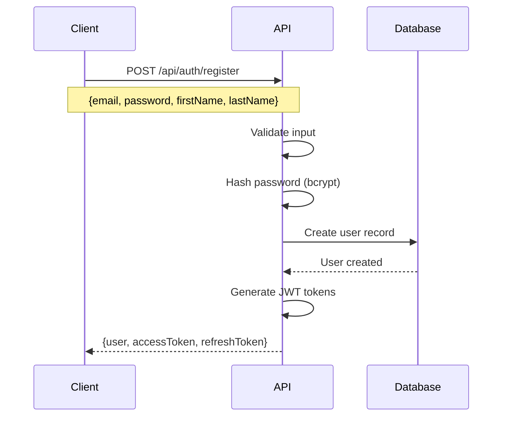
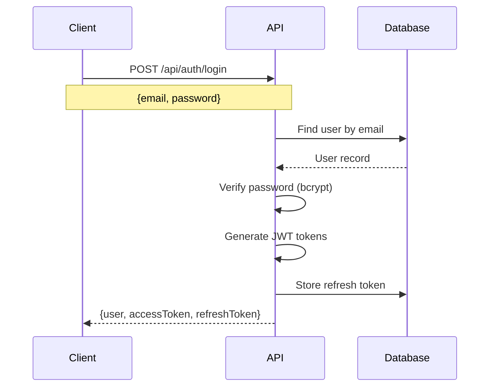
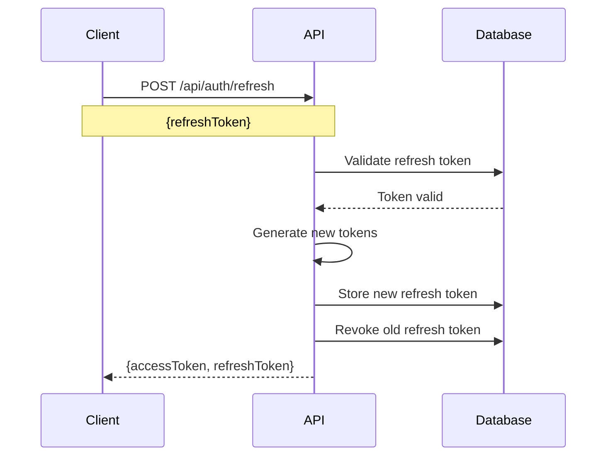

# Authentication Flow Guide

This guide provides comprehensive information about implementing authentication with the Visitor Management API, including JWT token usage, security best practices, and code examples.

## Overview

The API uses **JWT (JSON Web Tokens)** for authentication with a dual-token system:
- **Access Token**: Short-lived (15 minutes) for API requests
- **Refresh Token**: Long-lived (7 days) for obtaining new access tokens

## Authentication Flow

### 1. User Registration



**Request Example**:
```javascript
const response = await fetch('/api/auth/register', {
  method: 'POST',
  headers: {
    'Content-Type': 'application/json'
  },
  body: JSON.stringify({
    email: 'john.doe@example.com',
    password: 'SecurePass123!',
    firstName: 'John',
    lastName: 'Doe'
  })
});

const data = await response.json();
if (data.success) {
  // Store tokens securely
  localStorage.setItem('accessToken', data.accessToken);
  localStorage.setItem('refreshToken', data.refreshToken);
}
```

### 2. User Login



**Request Example**:
```javascript
const response = await fetch('/api/auth/login', {
  method: 'POST',
  headers: {
    'Content-Type': 'application/json'
  },
  body: JSON.stringify({
    email: 'john.doe@example.com',
    password: 'SecurePass123!'
  })
});

const data = await response.json();
if (data.success) {
  localStorage.setItem('accessToken', data.accessToken);
  localStorage.setItem('refreshToken', data.refreshToken);
  localStorage.setItem('user', JSON.stringify(data.user));
}
```

### 3. Making Authenticated Requests

All protected endpoints require the `Authorization` header with a valid access token:

```javascript
const response = await fetch('/api/visitors', {
  method: 'GET',
  headers: {
    'Authorization': `Bearer ${localStorage.getItem('accessToken')}`,
    'Content-Type': 'application/json'
  }
});
```

### 4. Token Refresh



**Implementation Example**:
```javascript
async function refreshToken() {
  const refreshToken = localStorage.getItem('refreshToken');
  
  const response = await fetch('/api/auth/refresh', {
    method: 'POST',
    headers: {
      'Content-Type': 'application/json'
    },
    body: JSON.stringify({ refreshToken })
  });
  
  const data = await response.json();
  if (data.success) {
    localStorage.setItem('accessToken', data.accessToken);
    localStorage.setItem('refreshToken', data.refreshToken);
    return data.accessToken;
  } else {
    // Refresh failed, redirect to login
    redirectToLogin();
    return null;
  }
}
```

### 5. Automatic Token Refresh

Implement automatic token refresh for seamless user experience:

```javascript
class ApiClient {
  constructor() {
    this.isRefreshing = false;
    this.failedQueue = [];
  }
  
  async request(url, options = {}) {
    try {
      return await this.makeRequest(url, options);
    } catch (error) {
      if (error.status === 401 && !options._retry) {
        return this.handleTokenRefresh(url, options);
      }
      throw error;
    }
  }
  
  async handleTokenRefresh(url, options) {
    if (this.isRefreshing) {
      // Queue the request while refresh is in progress
      return new Promise((resolve, reject) => {
        this.failedQueue.push({ resolve, reject, url, options });
      });
    }
    
    this.isRefreshing = true;
    
    try {
      const newToken = await this.refreshToken();
      this.processQueue(null, newToken);
      
      // Retry original request with new token
      options.headers = {
        ...options.headers,
        'Authorization': `Bearer ${newToken}`
      };
      options._retry = true;
      
      return this.makeRequest(url, options);
    } catch (refreshError) {
      this.processQueue(refreshError, null);
      this.redirectToLogin();
      throw refreshError;
    } finally {
      this.isRefreshing = false;
    }
  }
  
  processQueue(error, token) {
    this.failedQueue.forEach(({ resolve, reject, url, options }) => {
      if (error) {
        reject(error);
      } else {
        options.headers = {
          ...options.headers,
          'Authorization': `Bearer ${token}`
        };
        resolve(this.makeRequest(url, options));
      }
    });
    
    this.failedQueue = [];
  }
}
```

### 6. Logout

```javascript
async function logout() {
  const accessToken = localStorage.getItem('accessToken');
  
  try {
    await fetch('/api/auth/logout', {
      method: 'POST',
      headers: {
        'Authorization': `Bearer ${accessToken}`,
        'Content-Type': 'application/json'
      }
    });
  } catch (error) {
    console.warn('Logout request failed:', error);
  } finally {
    // Clear local storage regardless of API response
    localStorage.removeItem('accessToken');
    localStorage.removeItem('refreshToken');
    localStorage.removeItem('user');
    redirectToLogin();
  }
}
```

## Security Best Practices

### Token Storage

#### Web Applications
```javascript
// ✅ Secure storage options
// 1. HttpOnly cookies (most secure)
// Set by server, not accessible via JavaScript

// 2. Secure localStorage with additional protection
class SecureStorage {
  static setItem(key, value) {
    const encrypted = this.encrypt(value);
    localStorage.setItem(key, encrypted);
  }
  
  static getItem(key) {
    const encrypted = localStorage.getItem(key);
    return encrypted ? this.decrypt(encrypted) : null;
  }
  
  static encrypt(text) {
    // Use Web Crypto API for encryption
    // Implementation depends on your security requirements
  }
  
  static decrypt(encryptedText) {
    // Decrypt using Web Crypto API
  }
}

// ❌ Avoid storing in plain localStorage in production
localStorage.setItem('accessToken', token); // Not recommended
```

#### Mobile Applications
```javascript
// React Native with Keychain/Keystore
import * as Keychain from 'react-native-keychain';

// Store tokens securely
await Keychain.setInternetCredentials(
  'visitor-management-api',
  'accessToken',
  accessToken
);

// Retrieve tokens
const credentials = await Keychain.getInternetCredentials('visitor-management-api');
if (credentials) {
  const accessToken = credentials.password;
}
```

### Password Requirements

The API enforces strong password requirements:
- Minimum 8 characters
- At least one uppercase letter
- At least one lowercase letter
- At least one number
- At least one special character (@$!%*?&)

```javascript
function validatePassword(password) {
  const minLength = 8;
  const hasUpper = /[A-Z]/.test(password);
  const hasLower = /[a-z]/.test(password);
  const hasNumber = /\d/.test(password);
  const hasSpecial = /[@$!%*?&]/.test(password);
  
  return password.length >= minLength && hasUpper && hasLower && hasNumber && hasSpecial;
}
```

### Rate Limiting

Authentication endpoints are rate limited:
- **Login/Register**: 5 attempts per 15 minutes per IP
- **Token Refresh**: 5 attempts per 15 minutes per IP

Handle rate limiting gracefully:

```javascript
async function loginWithRetry(credentials, maxRetries = 3) {
  for (let attempt = 1; attempt <= maxRetries; attempt++) {
    try {
      return await login(credentials);
    } catch (error) {
      if (error.code === 'RATE_LIMIT_EXCEEDED') {
        const delay = Math.pow(2, attempt) * 1000; // Exponential backoff
        await new Promise(resolve => setTimeout(resolve, delay));
      } else {
        throw error;
      }
    }
  }
  throw new Error('Max login attempts exceeded');
}
```

## Platform-Specific Implementation

### Web Application (React)

```jsx
import React, { createContext, useContext, useReducer, useEffect } from 'react';

const AuthContext = createContext();

const authReducer = (state, action) => {
  switch (action.type) {
    case 'LOGIN_SUCCESS':
      return {
        ...state,
        isAuthenticated: true,
        user: action.payload.user,
        accessToken: action.payload.accessToken,
        refreshToken: action.payload.refreshToken
      };
    case 'LOGOUT':
      return {
        ...state,
        isAuthenticated: false,
        user: null,
        accessToken: null,
        refreshToken: null
      };
    case 'TOKEN_REFRESHED':
      return {
        ...state,
        accessToken: action.payload.accessToken,
        refreshToken: action.payload.refreshToken
      };
    default:
      return state;
  }
};

export const AuthProvider = ({ children }) => {
  const [state, dispatch] = useReducer(authReducer, {
    isAuthenticated: false,
    user: null,
    accessToken: null,
    refreshToken: null
  });
  
  useEffect(() => {
    // Check for stored tokens on app start
    const storedToken = localStorage.getItem('accessToken');
    const storedUser = localStorage.getItem('user');
    
    if (storedToken && storedUser) {
      dispatch({
        type: 'LOGIN_SUCCESS',
        payload: {
          user: JSON.parse(storedUser),
          accessToken: storedToken,
          refreshToken: localStorage.getItem('refreshToken')
        }
      });
    }
  }, []);
  
  const login = async (credentials) => {
    const response = await fetch('/api/auth/login', {
      method: 'POST',
      headers: { 'Content-Type': 'application/json' },
      body: JSON.stringify(credentials)
    });
    
    const data = await response.json();
    if (data.success) {
      localStorage.setItem('accessToken', data.accessToken);
      localStorage.setItem('refreshToken', data.refreshToken);
      localStorage.setItem('user', JSON.stringify(data.user));
      
      dispatch({
        type: 'LOGIN_SUCCESS',
        payload: data
      });
    }
    
    return data;
  };
  
  const logout = async () => {
    try {
      await fetch('/api/auth/logout', {
        method: 'POST',
        headers: {
          'Authorization': `Bearer ${state.accessToken}`,
          'Content-Type': 'application/json'
        }
      });
    } catch (error) {
      console.warn('Logout request failed:', error);
    }
    
    localStorage.removeItem('accessToken');
    localStorage.removeItem('refreshToken');
    localStorage.removeItem('user');
    
    dispatch({ type: 'LOGOUT' });
  };
  
  return (
    <AuthContext.Provider value={{ ...state, login, logout }}>
      {children}
    </AuthContext.Provider>
  );
};

export const useAuth = () => {
  const context = useContext(AuthContext);
  if (!context) {
    throw new Error('useAuth must be used within an AuthProvider');
  }
  return context;
};
```

### Mobile Application (React Native)

```javascript
import AsyncStorage from '@react-native-async-storage/async-storage';
import * as Keychain from 'react-native-keychain';

class AuthService {
  static async login(credentials) {
    try {
      const response = await fetch('/api/auth/login', {
        method: 'POST',
        headers: { 'Content-Type': 'application/json' },
        body: JSON.stringify(credentials)
      });
      
      const data = await response.json();
      if (data.success) {
        // Store tokens securely
        await Keychain.setInternetCredentials(
          'visitor-management-tokens',
          'tokens',
          JSON.stringify({
            accessToken: data.accessToken,
            refreshToken: data.refreshToken
          })
        );
        
        // Store user data in AsyncStorage
        await AsyncStorage.setItem('user', JSON.stringify(data.user));
      }
      
      return data;
    } catch (error) {
      console.error('Login failed:', error);
      throw error;
    }
  }
  
  static async getTokens() {
    try {
      const credentials = await Keychain.getInternetCredentials('visitor-management-tokens');
      if (credentials) {
        return JSON.parse(credentials.password);
      }
    } catch (error) {
      console.error('Failed to get tokens:', error);
    }
    return null;
  }
  
  static async logout() {
    try {
      const tokens = await this.getTokens();
      if (tokens) {
        await fetch('/api/auth/logout', {
          method: 'POST',
          headers: {
            'Authorization': `Bearer ${tokens.accessToken}`,
            'Content-Type': 'application/json'
          }
        });
      }
    } catch (error) {
      console.warn('Logout request failed:', error);
    } finally {
      // Clear stored data
      await Keychain.resetInternetCredentials('visitor-management-tokens');
      await AsyncStorage.removeItem('user');
    }
  }
}
```

## Error Handling

### Common Authentication Errors

```javascript
function handleAuthError(error) {
  switch (error.code) {
    case 'AUTHENTICATION_FAILED':
      if (error.message.includes('Invalid email or password')) {
        showError('Please check your email and password');
      } else if (error.message.includes('expired')) {
        // Token expired, try refresh
        return refreshToken();
      }
      break;
      
    case 'RATE_LIMIT_EXCEEDED':
      const resetTime = new Date(error.details.resetTime);
      showError(`Too many attempts. Try again at ${resetTime.toLocaleTimeString()}`);
      break;
      
    case 'VALIDATION_ERROR':
      const fieldErrors = error.details.map(d => `${d.field}: ${d.message}`);
      showError(fieldErrors.join('\n'));
      break;
      
    default:
      showError('Authentication failed. Please try again.');
  }
}
```

## Testing Authentication

### Unit Tests

```javascript
describe('Authentication Service', () => {
  test('should login successfully with valid credentials', async () => {
    const mockResponse = {
      success: true,
      user: { id: '123', email: 'test@example.com' },
      accessToken: 'mock-access-token',
      refreshToken: 'mock-refresh-token'
    };
    
    fetch.mockResolvedValueOnce({
      json: () => Promise.resolve(mockResponse)
    });
    
    const result = await AuthService.login({
      email: 'test@example.com',
      password: 'password123'
    });
    
    expect(result.success).toBe(true);
    expect(result.user.email).toBe('test@example.com');
  });
  
  test('should handle invalid credentials', async () => {
    const mockResponse = {
      success: false,
      error: {
        code: 'AUTHENTICATION_FAILED',
        message: 'Invalid email or password'
      }
    };
    
    fetch.mockResolvedValueOnce({
      json: () => Promise.resolve(mockResponse)
    });
    
    const result = await AuthService.login({
      email: 'test@example.com',
      password: 'wrongpassword'
    });
    
    expect(result.success).toBe(false);
    expect(result.error.code).toBe('AUTHENTICATION_FAILED');
  });
});
```

### Integration Tests

```javascript
describe('Authentication Flow Integration', () => {
  test('complete authentication flow', async () => {
    // 1. Register user
    const registerResponse = await request(app)
      .post('/api/auth/register')
      .send({
        email: 'test@example.com',
        password: 'SecurePass123!',
        firstName: 'Test',
        lastName: 'User'
      });
    
    expect(registerResponse.status).toBe(201);
    expect(registerResponse.body.success).toBe(true);
    
    const { accessToken, refreshToken } = registerResponse.body;
    
    // 2. Make authenticated request
    const visitorsResponse = await request(app)
      .get('/api/visitors')
      .set('Authorization', `Bearer ${accessToken}`);
    
    expect(visitorsResponse.status).toBe(200);
    
    // 3. Refresh token
    const refreshResponse = await request(app)
      .post('/api/auth/refresh')
      .send({ refreshToken });
    
    expect(refreshResponse.status).toBe(200);
    expect(refreshResponse.body.success).toBe(true);
    
    // 4. Logout
    const logoutResponse = await request(app)
      .post('/api/auth/logout')
      .set('Authorization', `Bearer ${accessToken}`);
    
    expect(logoutResponse.status).toBe(200);
  });
});
```

## Troubleshooting

### Common Issues

1. **Token Expired**: Implement automatic refresh
2. **CORS Issues**: Ensure proper CORS configuration
3. **Rate Limiting**: Implement exponential backoff
4. **Storage Issues**: Use secure storage methods
5. **Network Errors**: Handle offline scenarios

### Debug Mode

Enable debug logging for authentication issues:

```javascript
const DEBUG_AUTH = process.env.NODE_ENV === 'development';

function debugLog(message, data) {
  if (DEBUG_AUTH) {
    console.log(`[AUTH DEBUG] ${message}`, data);
  }
}

// Usage
debugLog('Login attempt', { email: credentials.email });
debugLog('Token refresh', { tokenExpiry: decoded.exp });
```