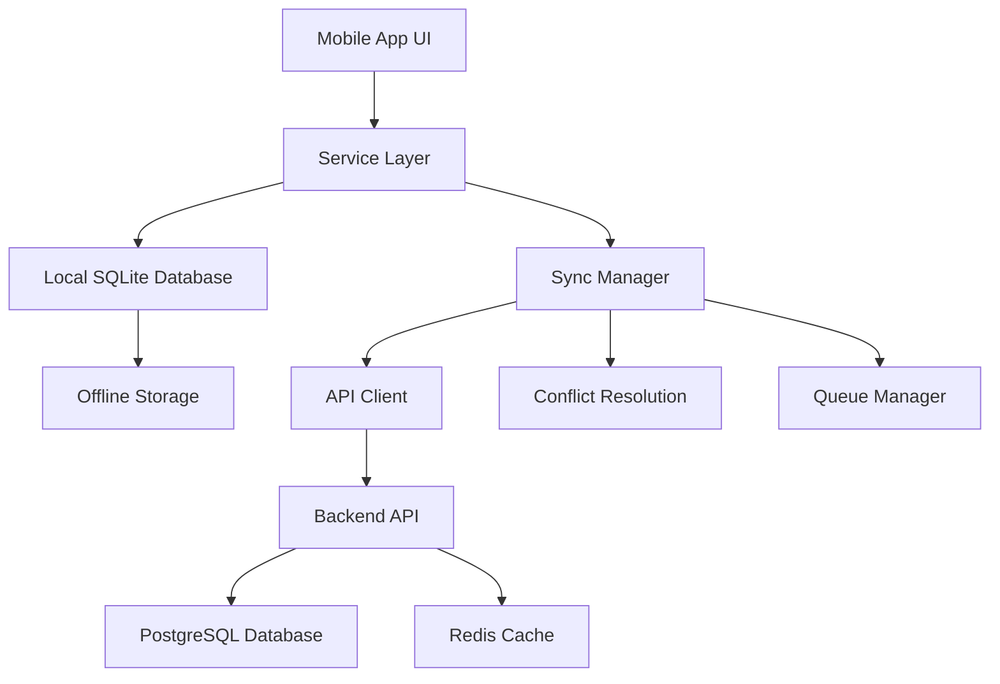

# Mobile App Integration Guide

This guide provides comprehensive instructions for integrating the Visitor Management API with mobile applications, including React Native examples, offline-first architecture, and synchronization strategies.

## Overview

The mobile app integration supports:
- **Offline-first architecture** with local SQLite storage
- **Automatic synchronization** when connectivity is restored
- **Conflict resolution** for concurrent modifications
- **Progressive data loading** for optimal performance
- **Real-time updates** through efficient polling

## Architecture Overview



## Setup and Configuration

### 1. Install Dependencies

```bash
# React Native project
npm install @react-native-async-storage/async-storage
npm install react-native-sqlite-storage
npm install react-native-keychain
npm install @react-native-community/netinfo

# For Expo projects
expo install expo-sqlite
expo install expo-secure-store
expo install @react-native-async-storage/async-storage
```

### 2. API Configuration

```javascript
// config/api.js
export const API_CONFIG = {
  baseURL: __DEV__ 
    ? 'http://localhost:3000/api' 
    : 'https://api.visitormanagement.com/api',
  timeout: 10000,
  retryAttempts: 3,
  retryDelay: 1000,
};

export const SYNC_CONFIG = {
  syncInterval: 30000, // 30 seconds
  batchSize: 100,
  maxRetries: 5,
  conflictResolution: 'server_wins', // 'server_wins', 'client_wins', 'merge'
};
```

## Core Services Implementation

### 1. API Client Service

```javascript
// services/ApiClient.js
import AsyncStorage from '@react-native-async-storage/async-storage';
import NetInfo from '@react-native-community/netinfo';
import { API_CONFIG } from '../config/api';

class ApiClient {
  constructor() {
    this.baseURL = API_CONFIG.baseURL;
    this.isOnline = true;
    this.requestQueue = [];
    
    // Monitor network connectivity
    NetInfo.addEventListener(state => {
      this.isOnline = state.isConnected;
      if (this.isOnline) {
        this.processQueue();
      }
    });
  }
  
  async request(endpoint, options = {}) {
    const url = `${this.baseURL}${endpoint}`;
    const config = {
      timeout: API_CONFIG.timeout,
      headers: {
        'Content-Type': 'application/json',
        ...options.headers,
      },
      ...options,
    };
    
    // Add authentication token
    const token = await this.getAccessToken();
    if (token) {
      config.headers.Authorization = `Bearer ${token}`;
    }
    
    try {
      const response = await this.fetchWithTimeout(url, config);
      const data = await response.json();
      
      if (!response.ok) {
        throw new ApiError(data.error || 'Request failed', response.status, data);
      }
      
      return data;
    } catch (error) {
      if (error.name === 'TypeError' && !this.isOnline) {
        // Network error while offline - queue for later
        if (options.queueOnFailure !== false) {
          this.queueRequest(endpoint, options);
        }
        throw new OfflineError('Request queued for when online');
      }
      
      if (error.status === 401) {
        // Token expired, try to refresh
        const refreshed = await this.refreshToken();
        if (refreshed && !options._retry) {
          options._retry = true;
          return this.request(endpoint, options);
        }
      }
      
      throw error;
    }
  }
  
  async fetchWithTimeout(url, options) {
    const controller = new AbortController();
    const timeoutId = setTimeout(() => controller.abort(), options.timeout);
    
    try {
      const response = await fetch(url, {
        ...options,
        signal: controller.signal,
      });
      clearTimeout(timeoutId);
      return response;
    } catch (error) {
      clearTimeout(timeoutId);
      throw error;
    }
  }
  
  async getAccessToken() {
    return await AsyncStorage.getItem('accessToken');
  }
  
  async refreshToken() {
    try {
      const refreshToken = await AsyncStorage.getItem('refreshToken');
      if (!refreshToken) return false;
      
      const response = await fetch(`${this.baseURL}/auth/refresh`, {
        method: 'POST',
        headers: { 'Content-Type': 'application/json' },
        body: JSON.stringify({ refreshToken }),
      });
      
      const data = await response.json();
      if (data.success) {
        await AsyncStorage.setItem('accessToken', data.accessToken);
        await AsyncStorage.setItem('refreshToken', data.refreshToken);
        return true;
      }
    } catch (error) {
      console.error('Token refresh failed:', error);
    }
    
    return false;
  }
  
  queueRequest(endpoint, options) {
    this.requestQueue.push({ endpoint, options, timestamp: Date.now() });
  }
  
  async processQueue() {
    const queue = [...this.requestQueue];
    this.requestQueue = [];
    
    for (const { endpoint, options } of queue) {
      try {
        await this.request(endpoint, { ...options, queueOnFailure: false });
      } catch (error) {
        console.error('Queued request failed:', error);
        // Re-queue if it's a temporary error
        if (error.status >= 500) {
          this.queueRequest(endpoint, options);
        }
      }
    }
  }
}

class ApiError extends Error {
  constructor(message, status, data) {
    super(message);
    this.name = 'ApiError';
    this.status = status;
    this.data = data;
  }
}

class OfflineError extends Error {
  constructor(message) {
    super(message);
    this.name = 'OfflineError';
  }
}

export default new ApiClient();
```

### 2. Local Database Service

```javascript
// services/DatabaseService.js
import SQLite from 'react-native-sqlite-storage';

class DatabaseService {
  constructor() {
    this.db = null;
  }
  
  async initialize() {
    this.db = await SQLite.openDatabase({
      name: 'VisitorManagement.db',
      location: 'default',
    });
    
    await this.createTables();
  }
  
  async createTables() {
    const createVisitorsTable = `
      CREATE TABLE IF NOT EXISTS visitors (
        id TEXT PRIMARY KEY,
        server_id TEXT,
        name TEXT NOT NULL,
        title TEXT,
        company TEXT NOT NULL,
        phone TEXT,
        email TEXT,
        website TEXT,
        interests TEXT, -- JSON string
        notes TEXT,
        capture_method TEXT NOT NULL,
        captured_at TEXT NOT NULL,
        created_at TEXT NOT NULL,
        updated_at TEXT NOT NULL,
        sync_status TEXT DEFAULT 'pending', -- 'pending', 'synced', 'conflict'
        sync_version INTEGER DEFAULT 1,
        is_deleted INTEGER DEFAULT 0
      )
    `;
    
    const createSyncLogTable = `
      CREATE TABLE IF NOT EXISTS sync_log (
        id INTEGER PRIMARY KEY AUTOINCREMENT,
        operation TEXT NOT NULL, -- 'create', 'update', 'delete'
        local_id TEXT NOT NULL,
        server_id TEXT,
        status TEXT NOT NULL, -- 'pending', 'success', 'error', 'conflict'
        error_message TEXT,
        created_at TEXT NOT NULL,
        synced_at TEXT
      )
    `;
    
    await this.db.executeSql(createVisitorsTable);
    await this.db.executeSql(createSyncLogTable);
  }
  
  async createVisitor(visitor) {
    const id = this.generateLocalId();
    const now = new Date().toISOString();
    
    const query = `
      INSERT INTO visitors (
        id, name, title, company, phone, email, website, 
        interests, notes, capture_method, captured_at, 
        created_at, updated_at, sync_status
      ) VALUES (?, ?, ?, ?, ?, ?, ?, ?, ?, ?, ?, ?, ?, ?)
    `;
    
    const params = [
      id, visitor.name, visitor.title, visitor.company,
      visitor.phone, visitor.email, visitor.website,
      JSON.stringify(visitor.interests), visitor.notes,
      visitor.captureMethod, visitor.capturedAt,
      now, now, 'pending'
    ];
    
    await this.db.executeSql(query, params);
    
    // Log sync operation
    await this.logSyncOperation('create', id);
    
    return { ...visitor, id, createdAt: now, updatedAt: now };
  }
  
  async updateVisitor(id, updates) {
    const now = new Date().toISOString();
    
    const setClause = Object.keys(updates)
      .map(key => `${this.camelToSnake(key)} = ?`)
      .join(', ');
    
    const query = `
      UPDATE visitors 
      SET ${setClause}, updated_at = ?, sync_status = 'pending', sync_version = sync_version + 1
      WHERE id = ? AND is_deleted = 0
    `;
    
    const params = [
      ...Object.values(updates).map(value => 
        typeof value === 'object' ? JSON.stringify(value) : value
      ),
      now,
      id
    ];
    
    await this.db.executeSql(query, params);
    await this.logSyncOperation('update', id);
  }
  
  async deleteVisitor(id) {
    const now = new Date().toISOString();
    
    const query = `
      UPDATE visitors 
      SET is_deleted = 1, updated_at = ?, sync_status = 'pending'
      WHERE id = ? AND is_deleted = 0
    `;
    
    await this.db.executeSql(query, [now, id]);
    await this.logSyncOperation('delete', id);
  }
  
  async getVisitors(filters = {}) {
    let query = `
      SELECT * FROM visitors 
      WHERE is_deleted = 0
    `;
    const params = [];
    
    if (filters.company) {
      query += ` AND company LIKE ?`;
      params.push(`%${filters.company}%`);
    }
    
    if (filters.captureMethod) {
      query += ` AND capture_method = ?`;
      params.push(filters.captureMethod);
    }
    
    query += ` ORDER BY captured_at DESC`;
    
    if (filters.limit) {
      query += ` LIMIT ?`;
      params.push(filters.limit);
    }
    
    const [results] = await this.db.executeSql(query, params);
    
    return Array.from({ length: results.rows.length }, (_, i) => {
      const row = results.rows.item(i);
      return {
        ...row,
        interests: JSON.parse(row.interests || '[]'),
        isDeleted: Boolean(row.is_deleted),
        syncStatus: row.sync_status,
        syncVersion: row.sync_version,
        createdAt: row.created_at,
        updatedAt: row.updated_at,
        capturedAt: row.captured_at,
        captureMethod: row.capture_method,
        serverId: row.server_id,
      };
    });
  }
  
  async getPendingSyncOperations() {
    const query = `
      SELECT sl.*, v.* FROM sync_log sl
      LEFT JOIN visitors v ON sl.local_id = v.id
      WHERE sl.status = 'pending'
      ORDER BY sl.created_at ASC
    `;
    
    const [results] = await this.db.executeSql(query);
    
    return Array.from({ length: results.rows.length }, (_, i) => {
      const row = results.rows.item(i);
      return {
        operation: row.operation,
        localId: row.local_id,
        serverId: row.server_id,
        visitor: row.name ? {
          id: row.local_id,
          name: row.name,
          title: row.title,
          company: row.company,
          phone: row.phone,
          email: row.email,
          website: row.website,
          interests: JSON.parse(row.interests || '[]'),
          notes: row.notes,
          captureMethod: row.capture_method,
          capturedAt: row.captured_at,
        } : null,
      };
    });
  }
  
  async logSyncOperation(operation, localId, serverId = null) {
    const query = `
      INSERT INTO sync_log (operation, local_id, server_id, status, created_at)
      VALUES (?, ?, ?, 'pending', ?)
    `;
    
    await this.db.executeSql(query, [
      operation, localId, serverId, new Date().toISOString()
    ]);
  }
  
  async updateSyncStatus(localId, status, serverId = null, errorMessage = null) {
    const query = `
      UPDATE sync_log 
      SET status = ?, server_id = ?, error_message = ?, synced_at = ?
      WHERE local_id = ? AND status = 'pending'
    `;
    
    await this.db.executeSql(query, [
      status, serverId, errorMessage, new Date().toISOString(), localId
    ]);
    
    if (status === 'success') {
      // Update visitor sync status
      const updateVisitorQuery = `
        UPDATE visitors 
        SET sync_status = 'synced', server_id = ?
        WHERE id = ?
      `;
      await this.db.executeSql(updateVisitorQuery, [serverId, localId]);
    }
  }
  
  generateLocalId() {
    return `local_${Date.now()}_${Math.random().toString(36).substr(2, 9)}`;
  }
  
  camelToSnake(str) {
    return str.replace(/[A-Z]/g, letter => `_${letter.toLowerCase()}`);
  }
}

export default new DatabaseService();
```

### 3. Synchronization Service

```javascript
// services/SyncService.js
import ApiClient from './ApiClient';
import DatabaseService from './DatabaseService';
import { SYNC_CONFIG } from '../config/api';

class SyncService {
  constructor() {
    this.isSyncing = false;
    this.syncInterval = null;
  }
  
  startAutoSync() {
    if (this.syncInterval) return;
    
    this.syncInterval = setInterval(() => {
      this.syncData();
    }, SYNC_CONFIG.syncInterval);
    
    // Initial sync
    this.syncData();
  }
  
  stopAutoSync() {
    if (this.syncInterval) {
      clearInterval(this.syncInterval);
      this.syncInterval = null;
    }
  }
  
  async syncData() {
    if (this.isSyncing) return;
    
    this.isSyncing = true;
    
    try {
      const pendingOperations = await DatabaseService.getPendingSyncOperations();
      
      if (pendingOperations.length === 0) {
        return { success: true, message: 'No pending operations' };
      }
      
      // Group operations into batches
      const batches = this.createBatches(pendingOperations, SYNC_CONFIG.batchSize);
      
      for (const batch of batches) {
        await this.syncBatch(batch);
      }
      
      return { success: true, synced: pendingOperations.length };
    } catch (error) {
      console.error('Sync failed:', error);
      return { success: false, error: error.message };
    } finally {
      this.isSyncing = false;
    }
  }
  
  async syncBatch(operations) {
    const syncOperations = operations.map(op => ({
      action: op.operation,
      localId: op.localId,
      serverId: op.serverId,
      timestamp: new Date().toISOString(),
      data: op.visitor,
    }));
    
    try {
      const response = await ApiClient.request('/visitors/bulk-sync', {
        method: 'POST',
        body: JSON.stringify({
          operations: syncOperations,
          lastSyncTimestamp: await this.getLastSyncTimestamp(),
        }),
      });
      
      if (response.success) {
        await this.processSyncResults(response.results);
        await this.handleConflicts(response.conflicts);
        await this.setLastSyncTimestamp(response.syncTimestamp);
      }
      
      return response;
    } catch (error) {
      // Mark operations as failed
      for (const op of operations) {
        await DatabaseService.updateSyncStatus(
          op.localId, 
          'error', 
          null, 
          error.message
        );
      }
      throw error;
    }
  }
  
  async processSyncResults(results) {
    for (const result of results) {
      if (result.status === 'success') {
        await DatabaseService.updateSyncStatus(
          result.localId,
          'success',
          result.serverId
        );
      } else if (result.status === 'error') {
        await DatabaseService.updateSyncStatus(
          result.localId,
          'error',
          null,
          result.error
        );
      }
    }
  }
  
  async handleConflicts(conflicts) {
    for (const conflict of conflicts) {
      const resolution = await this.resolveConflict(conflict);
      
      if (resolution) {
        try {
          await ApiClient.request('/visitors/sync/resolve-conflicts', {
            method: 'POST',
            body: JSON.stringify({
              conflicts: [{
                localId: conflict.localId,
                strategy: resolution.strategy,
                resolvedData: resolution.data,
              }],
            }),
          });
          
          await DatabaseService.updateSyncStatus(
            conflict.localId,
            'success',
            conflict.serverId
          );
        } catch (error) {
          console.error('Conflict resolution failed:', error);
        }
      }
    }
  }
  
  async resolveConflict(conflict) {
    // Implement conflict resolution strategy
    switch (SYNC_CONFIG.conflictResolution) {
      case 'server_wins':
        return {
          strategy: 'server_wins',
          data: conflict.conflictData.serverData,
        };
        
      case 'client_wins':
        return {
          strategy: 'client_wins',
          data: conflict.conflictData.clientData,
        };
        
      case 'merge':
        return {
          strategy: 'merge',
          data: this.mergeConflictData(
            conflict.conflictData.clientData,
            conflict.conflictData.serverData
          ),
        };
        
      default:
        // Show conflict resolution UI to user
        return await this.showConflictResolutionDialog(conflict);
    }
  }
  
  mergeConflictData(clientData, serverData) {
    // Simple merge strategy - prefer client for user-editable fields
    return {
      ...serverData,
      ...clientData,
      // Merge interests arrays
      interests: [
        ...new Set([
          ...(clientData.interests || []),
          ...(serverData.interests || [])
        ])
      ],
      // Combine notes
      notes: [clientData.notes, serverData.notes]
        .filter(Boolean)
        .join('\n---\n'),
    };
  }
  
  createBatches(items, batchSize) {
    const batches = [];
    for (let i = 0; i < items.length; i += batchSize) {
      batches.push(items.slice(i, i + batchSize));
    }
    return batches;
  }
  
  async getLastSyncTimestamp() {
    return await AsyncStorage.getItem('lastSyncTimestamp');
  }
  
  async setLastSyncTimestamp(timestamp) {
    await AsyncStorage.setItem('lastSyncTimestamp', timestamp);
  }
}

export default new SyncService();
```

## React Native Component Examples

### 1. Visitor List Component

```jsx
// components/VisitorList.jsx
import React, { useState, useEffect } from 'react';
import {
  View,
  Text,
  FlatList,
  TouchableOpacity,
  RefreshControl,
  StyleSheet,
  Alert,
} from 'react-native';
import DatabaseService from '../services/DatabaseService';
import SyncService from '../services/SyncService';

const VisitorList = ({ navigation }) => {
  const [visitors, setVisitors] = useState([]);
  const [loading, setLoading] = useState(true);
  const [refreshing, setRefreshing] = useState(false);
  const [syncStatus, setSyncStatus] = useState('idle');
  
  useEffect(() => {
    loadVisitors();
    
    // Start auto-sync
    SyncService.startAutoSync();
    
    return () => {
      SyncService.stopAutoSync();
    };
  }, []);
  
  const loadVisitors = async () => {
    try {
      const data = await DatabaseService.getVisitors();
      setVisitors(data);
    } catch (error) {
      console.error('Failed to load visitors:', error);
      Alert.alert('Error', 'Failed to load visitors');
    } finally {
      setLoading(false);
    }
  };
  
  const handleRefresh = async () => {
    setRefreshing(true);
    setSyncStatus('syncing');
    
    try {
      const result = await SyncService.syncData();
      if (result.success) {
        await loadVisitors();
        setSyncStatus('success');
      } else {
        setSyncStatus('error');
        Alert.alert('Sync Error', result.error);
      }
    } catch (error) {
      setSyncStatus('error');
      Alert.alert('Sync Error', 'Failed to sync data');
    } finally {
      setRefreshing(false);
      setTimeout(() => setSyncStatus('idle'), 2000);
    }
  };
  
  const renderVisitor = ({ item }) => (
    <TouchableOpacity
      style={[
        styles.visitorItem,
        item.syncStatus === 'pending' && styles.pendingSync,
        item.syncStatus === 'conflict' && styles.conflictSync,
      ]}
      onPress={() => navigation.navigate('VisitorDetail', { visitor: item })}
    >
      <View style={styles.visitorInfo}>
        <Text style={styles.visitorName}>{item.name}</Text>
        <Text style={styles.visitorCompany}>{item.company}</Text>
        {item.title && <Text style={styles.visitorTitle}>{item.title}</Text>}
      </View>
      
      <View style={styles.visitorMeta}>
        <Text style={styles.captureMethod}>
          {item.captureMethod === 'business_card' ? '💳' : '🏷️'}
        </Text>
        {item.syncStatus === 'pending' && (
          <Text style={styles.syncPending}>⏳</Text>
        )}
        {item.syncStatus === 'conflict' && (
          <Text style={styles.syncConflict}>⚠️</Text>
        )}
      </View>
    </TouchableOpacity>
  );
  
  const getSyncStatusText = () => {
    switch (syncStatus) {
      case 'syncing': return 'Syncing...';
      case 'success': return 'Synced successfully';
      case 'error': return 'Sync failed';
      default: return '';
    }
  };
  
  return (
    <View style={styles.container}>
      {syncStatus !== 'idle' && (
        <View style={[
          styles.syncStatus,
          syncStatus === 'success' && styles.syncSuccess,
          syncStatus === 'error' && styles.syncError,
        ]}>
          <Text style={styles.syncStatusText}>{getSyncStatusText()}</Text>
        </View>
      )}
      
      <FlatList
        data={visitors}
        renderItem={renderVisitor}
        keyExtractor={item => item.id}
        refreshControl={
          <RefreshControl
            refreshing={refreshing}
            onRefresh={handleRefresh}
          />
        }
        ListEmptyComponent={
          <View style={styles.emptyState}>
            <Text style={styles.emptyText}>No visitors yet</Text>
            <Text style={styles.emptySubtext}>
              Pull down to sync or add a new visitor
            </Text>
          </View>
        }
      />
    </View>
  );
};

const styles = StyleSheet.create({
  container: {
    flex: 1,
    backgroundColor: '#f5f5f5',
  },
  syncStatus: {
    padding: 12,
    backgroundColor: '#007AFF',
    alignItems: 'center',
  },
  syncSuccess: {
    backgroundColor: '#34C759',
  },
  syncError: {
    backgroundColor: '#FF3B30',
  },
  syncStatusText: {
    color: 'white',
    fontWeight: '500',
  },
  visitorItem: {
    backgroundColor: 'white',
    padding: 16,
    marginHorizontal: 16,
    marginVertical: 4,
    borderRadius: 8,
    flexDirection: 'row',
    justifyContent: 'space-between',
    alignItems: 'center',
    shadowColor: '#000',
    shadowOffset: { width: 0, height: 1 },
    shadowOpacity: 0.1,
    shadowRadius: 2,
    elevation: 2,
  },
  pendingSync: {
    borderLeftWidth: 4,
    borderLeftColor: '#FF9500',
  },
  conflictSync: {
    borderLeftWidth: 4,
    borderLeftColor: '#FF3B30',
  },
  visitorInfo: {
    flex: 1,
  },
  visitorName: {
    fontSize: 16,
    fontWeight: '600',
    color: '#333',
  },
  visitorCompany: {
    fontSize: 14,
    color: '#666',
    marginTop: 2,
  },
  visitorTitle: {
    fontSize: 12,
    color: '#999',
    marginTop: 1,
  },
  visitorMeta: {
    flexDirection: 'row',
    alignItems: 'center',
  },
  captureMethod: {
    fontSize: 20,
    marginRight: 8,
  },
  syncPending: {
    fontSize: 16,
  },
  syncConflict: {
    fontSize: 16,
  },
  emptyState: {
    flex: 1,
    justifyContent: 'center',
    alignItems: 'center',
    paddingTop: 100,
  },
  emptyText: {
    fontSize: 18,
    fontWeight: '600',
    color: '#666',
    marginBottom: 8,
  },
  emptySubtext: {
    fontSize: 14,
    color: '#999',
    textAlign: 'center',
  },
});

export default VisitorList;
```

### 2. Visitor Form Component

```jsx
// components/VisitorForm.jsx
import React, { useState } from 'react';
import {
  View,
  Text,
  TextInput,
  TouchableOpacity,
  ScrollView,
  Alert,
  StyleSheet,
} from 'react-native';
import DatabaseService from '../services/DatabaseService';

const VisitorForm = ({ navigation, route }) => {
  const { visitor } = route.params || {};
  const isEditing = Boolean(visitor);
  
  const [formData, setFormData] = useState({
    name: visitor?.name || '',
    title: visitor?.title || '',
    company: visitor?.company || '',
    phone: visitor?.phone || '',
    email: visitor?.email || '',
    website: visitor?.website || '',
    interests: visitor?.interests?.join(', ') || '',
    notes: visitor?.notes || '',
    captureMethod: visitor?.captureMethod || 'business_card',
  });
  
  const [saving, setSaving] = useState(false);
  
  const handleSave = async () => {
    if (!formData.name.trim() || !formData.company.trim()) {
      Alert.alert('Validation Error', 'Name and company are required');
      return;
    }
    
    setSaving(true);
    
    try {
      const visitorData = {
        ...formData,
        interests: formData.interests
          .split(',')
          .map(interest => interest.trim())
          .filter(Boolean),
        capturedAt: visitor?.capturedAt || new Date().toISOString(),
      };
      
      if (isEditing) {
        await DatabaseService.updateVisitor(visitor.id, visitorData);
        Alert.alert('Success', 'Visitor updated successfully');
      } else {
        await DatabaseService.createVisitor(visitorData);
        Alert.alert('Success', 'Visitor created successfully');
      }
      
      navigation.goBack();
    } catch (error) {
      console.error('Failed to save visitor:', error);
      Alert.alert('Error', 'Failed to save visitor');
    } finally {
      setSaving(false);
    }
  };
  
  const handleDelete = async () => {
    Alert.alert(
      'Delete Visitor',
      'Are you sure you want to delete this visitor?',
      [
        { text: 'Cancel', style: 'cancel' },
        {
          text: 'Delete',
          style: 'destructive',
          onPress: async () => {
            try {
              await DatabaseService.deleteVisitor(visitor.id);
              Alert.alert('Success', 'Visitor deleted successfully');
              navigation.goBack();
            } catch (error) {
              Alert.alert('Error', 'Failed to delete visitor');
            }
          },
        },
      ]
    );
  };
  
  return (
    <ScrollView style={styles.container}>
      <View style={styles.form}>
        <View style={styles.inputGroup}>
          <Text style={styles.label}>Name *</Text>
          <TextInput
            style={styles.input}
            value={formData.name}
            onChangeText={text => setFormData({ ...formData, name: text })}
            placeholder="Enter visitor name"
          />
        </View>
        
        <View style={styles.inputGroup}>
          <Text style={styles.label}>Title</Text>
          <TextInput
            style={styles.input}
            value={formData.title}
            onChangeText={text => setFormData({ ...formData, title: text })}
            placeholder="Job title"
          />
        </View>
        
        <View style={styles.inputGroup}>
          <Text style={styles.label}>Company *</Text>
          <TextInput
            style={styles.input}
            value={formData.company}
            onChangeText={text => setFormData({ ...formData, company: text })}
            placeholder="Company name"
          />
        </View>
        
        <View style={styles.inputGroup}>
          <Text style={styles.label}>Phone</Text>
          <TextInput
            style={styles.input}
            value={formData.phone}
            onChangeText={text => setFormData({ ...formData, phone: text })}
            placeholder="Phone number"
            keyboardType="phone-pad"
          />
        </View>
        
        <View style={styles.inputGroup}>
          <Text style={styles.label}>Email</Text>
          <TextInput
            style={styles.input}
            value={formData.email}
            onChangeText={text => setFormData({ ...formData, email: text })}
            placeholder="Email address"
            keyboardType="email-address"
            autoCapitalize="none"
          />
        </View>
        
        <View style={styles.inputGroup}>
          <Text style={styles.label}>Website</Text>
          <TextInput
            style={styles.input}
            value={formData.website}
            onChangeText={text => setFormData({ ...formData, website: text })}
            placeholder="Website URL"
            keyboardType="url"
            autoCapitalize="none"
          />
        </View>
        
        <View style={styles.inputGroup}>
          <Text style={styles.label}>Interests</Text>
          <TextInput
            style={styles.input}
            value={formData.interests}
            onChangeText={text => setFormData({ ...formData, interests: text })}
            placeholder="Comma-separated interests"
            multiline
          />
        </View>
        
        <View style={styles.inputGroup}>
          <Text style={styles.label}>Notes</Text>
          <TextInput
            style={[styles.input, styles.textArea]}
            value={formData.notes}
            onChangeText={text => setFormData({ ...formData, notes: text })}
            placeholder="Additional notes"
            multiline
            numberOfLines={4}
          />
        </View>
        
        <View style={styles.inputGroup}>
          <Text style={styles.label}>Capture Method</Text>
          <View style={styles.radioGroup}>
            <TouchableOpacity
              style={[
                styles.radioOption,
                formData.captureMethod === 'business_card' && styles.radioSelected,
              ]}
              onPress={() => setFormData({ ...formData, captureMethod: 'business_card' })}
            >
              <Text style={styles.radioText}>💳 Business Card</Text>
            </TouchableOpacity>
            <TouchableOpacity
              style={[
                styles.radioOption,
                formData.captureMethod === 'event_badge' && styles.radioSelected,
              ]}
              onPress={() => setFormData({ ...formData, captureMethod: 'event_badge' })}
            >
              <Text style={styles.radioText}>🏷️ Event Badge</Text>
            </TouchableOpacity>
          </View>
        </View>
        
        <TouchableOpacity
          style={[styles.saveButton, saving && styles.saveButtonDisabled]}
          onPress={handleSave}
          disabled={saving}
        >
          <Text style={styles.saveButtonText}>
            {saving ? 'Saving...' : isEditing ? 'Update Visitor' : 'Create Visitor'}
          </Text>
        </TouchableOpacity>
        
        {isEditing && (
          <TouchableOpacity
            style={styles.deleteButton}
            onPress={handleDelete}
          >
            <Text style={styles.deleteButtonText}>Delete Visitor</Text>
          </TouchableOpacity>
        )}
      </View>
    </ScrollView>
  );
};

const styles = StyleSheet.create({
  container: {
    flex: 1,
    backgroundColor: '#f5f5f5',
  },
  form: {
    padding: 16,
  },
  inputGroup: {
    marginBottom: 20,
  },
  label: {
    fontSize: 16,
    fontWeight: '600',
    color: '#333',
    marginBottom: 8,
  },
  input: {
    backgroundColor: 'white',
    borderWidth: 1,
    borderColor: '#ddd',
    borderRadius: 8,
    padding: 12,
    fontSize: 16,
  },
  textArea: {
    height: 100,
    textAlignVertical: 'top',
  },
  radioGroup: {
    flexDirection: 'row',
    gap: 12,
  },
  radioOption: {
    flex: 1,
    backgroundColor: 'white',
    borderWidth: 1,
    borderColor: '#ddd',
    borderRadius: 8,
    padding: 12,
    alignItems: 'center',
  },
  radioSelected: {
    borderColor: '#007AFF',
    backgroundColor: '#E3F2FD',
  },
  radioText: {
    fontSize: 16,
    color: '#333',
  },
  saveButton: {
    backgroundColor: '#007AFF',
    borderRadius: 8,
    padding: 16,
    alignItems: 'center',
    marginTop: 20,
  },
  saveButtonDisabled: {
    backgroundColor: '#ccc',
  },
  saveButtonText: {
    color: 'white',
    fontSize: 16,
    fontWeight: '600',
  },
  deleteButton: {
    backgroundColor: '#FF3B30',
    borderRadius: 8,
    padding: 16,
    alignItems: 'center',
    marginTop: 12,
  },
  deleteButtonText: {
    color: 'white',
    fontSize: 16,
    fontWeight: '600',
  },
});

export default VisitorForm;
```

## Testing the Integration

### 1. Unit Tests

```javascript
// __tests__/services/DatabaseService.test.js
import DatabaseService from '../../services/DatabaseService';

describe('DatabaseService', () => {
  beforeEach(async () => {
    await DatabaseService.initialize();
  });
  
  test('should create visitor successfully', async () => {
    const visitor = {
      name: 'John Doe',
      company: 'Test Corp',
      interests: ['technology'],
      captureMethod: 'business_card',
      capturedAt: new Date().toISOString(),
    };
    
    const result = await DatabaseService.createVisitor(visitor);
    
    expect(result.id).toBeDefined();
    expect(result.name).toBe(visitor.name);
    expect(result.company).toBe(visitor.company);
  });
  
  test('should retrieve visitors with filters', async () => {
    // Create test data
    await DatabaseService.createVisitor({
      name: 'Jane Smith',
      company: 'Tech Corp',
      interests: ['marketing'],
      captureMethod: 'business_card',
      capturedAt: new Date().toISOString(),
    });
    
    const visitors = await DatabaseService.getVisitors({
      company: 'Tech',
    });
    
    expect(visitors.length).toBeGreaterThan(0);
    expect(visitors[0].company).toContain('Tech');
  });
});
```

### 2. Integration Tests

```javascript
// __tests__/integration/sync.test.js
import SyncService from '../../services/SyncService';
import DatabaseService from '../../services/DatabaseService';
import ApiClient from '../../services/ApiClient';

jest.mock('../../services/ApiClient');

describe('Sync Integration', () => {
  test('should sync pending operations', async () => {
    // Create local visitor
    const visitor = await DatabaseService.createVisitor({
      name: 'Test User',
      company: 'Test Company',
      interests: ['testing'],
      captureMethod: 'business_card',
      capturedAt: new Date().toISOString(),
    });
    
    // Mock API response
    ApiClient.request.mockResolvedValue({
      success: true,
      results: [{
        localId: visitor.id,
        serverId: 'server-123',
        status: 'success',
      }],
      conflicts: [],
      syncTimestamp: new Date().toISOString(),
    });
    
    const result = await SyncService.syncData();
    
    expect(result.success).toBe(true);
    expect(ApiClient.request).toHaveBeenCalledWith('/visitors/bulk-sync', {
      method: 'POST',
      body: expect.stringContaining(visitor.id),
    });
  });
});
```

## Troubleshooting Common Issues

### 1. Sync Conflicts

```javascript
// Handle sync conflicts in your app
const handleSyncConflict = async (conflict) => {
  return new Promise((resolve) => {
    Alert.alert(
      'Data Conflict',
      `The visitor "${conflict.conflictData.clientData.name}" has been modified both locally and on the server. How would you like to resolve this?`,
      [
        {
          text: 'Use Server Version',
          onPress: () => resolve({ strategy: 'server_wins' }),
        },
        {
          text: 'Use Local Version',
          onPress: () => resolve({ strategy: 'client_wins' }),
        },
        {
          text: 'Merge Both',
          onPress: () => resolve({ strategy: 'merge' }),
        },
      ]
    );
  });
};
```

### 2. Network Error Handling

```javascript
// Robust error handling for network issues
const handleNetworkError = (error) => {
  if (error.name === 'OfflineError') {
    // Data will be synced when back online
    showToast('Saved locally. Will sync when online.');
  } else if (error.status >= 500) {
    // Server error - retry later
    showToast('Server error. Will retry automatically.');
  } else if (error.status === 401) {
    // Authentication error - redirect to login
    navigation.navigate('Login');
  } else {
    // Other errors
    showToast('An error occurred. Please try again.');
  }
};
```

### 3. Performance Optimization

```javascript
// Optimize large data sets with pagination
const loadVisitorsWithPagination = async (page = 1, limit = 20) => {
  const offset = (page - 1) * limit;
  
  const visitors = await DatabaseService.getVisitors({
    limit,
    offset,
  });
  
  return visitors;
};

// Use FlatList with pagination
const [visitors, setVisitors] = useState([]);
const [page, setPage] = useState(1);
const [loading, setLoading] = useState(false);

const loadMoreVisitors = async () => {
  if (loading) return;
  
  setLoading(true);
  const newVisitors = await loadVisitorsWithPagination(page + 1);
  
  setVisitors(prev => [...prev, ...newVisitors]);
  setPage(prev => prev + 1);
  setLoading(false);
};
```

This comprehensive mobile integration guide provides everything needed to implement a robust offline-first mobile application that seamlessly synchronizes with the Visitor Management API.